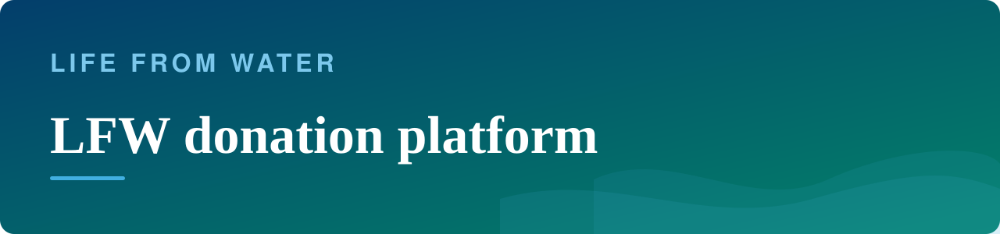
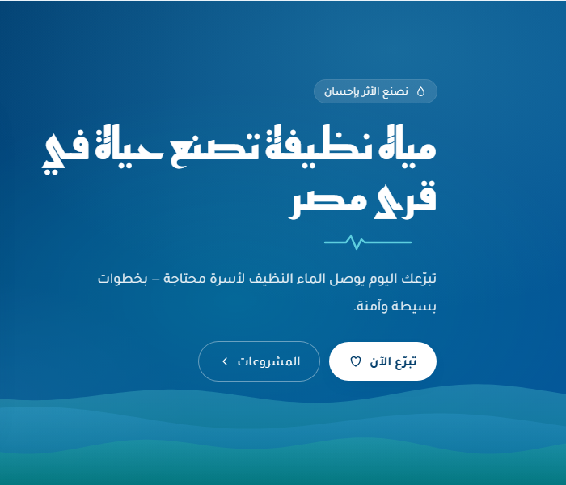
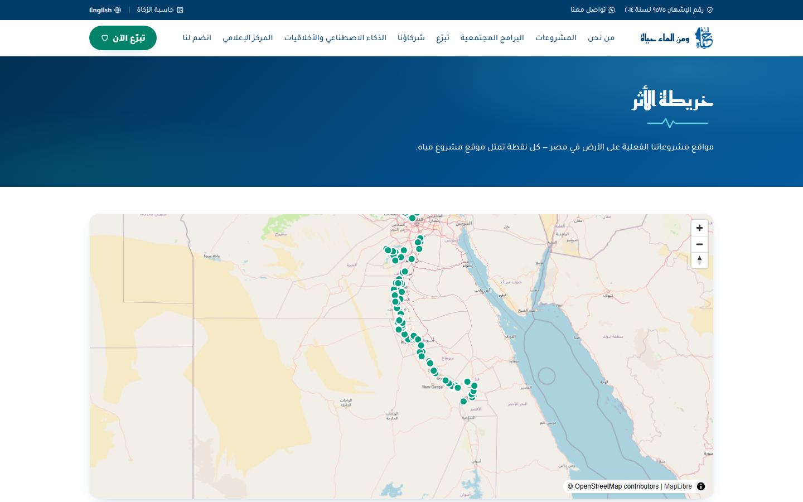

<b>A donation platform in the making, with impact you can check, for our water-access work in rural Egypt</b>

منصة للتبرّع ومتابعة الأثر بشفافية — مؤسسة ومن الماء حياة

<b>Status:</b> Prototype live · online donations not yet enabled &nbsp;·&nbsp; <b>Built by</b> <a href="https://github.com/Mohanad1st">Mohannad Hesham</a>

> This is a case study. The source is private because it is built to handle donor payments and personal data.

## Why we built it

Donors are asked to trust a PDF report. We connect households in rural Egypt to clean water, and every funded site has a place and a year. This platform is built to let a donor give in a few steps with local payment methods, get a receipt automatically, and see on a public map where funded work happened.

## What it does

- Arabic-first pages for our projects, programmes, partners, media and annual reports.
- A public impact map of funded sites, with years and beneficiary counts.
- One-time and recurring donations through Egyptian cards and wallets, with automatic receipts (built, not yet enabled: it needs a payment contract and permit sign-off).
- Donor accounts to see past gifts and manage recurring ones (built, not yet enabled).
- Memorial gifts with a dedication card (not yet enabled).
- A staff console for bilingual updates (not yet enabled).

## How it works

**[Open the Life From Water donation prototype](https://lfw-mockup.vercel.app)**

 Homepage (Arabic)

 Public impact map (prototype): project sites loaded so far

All screens show demo data or public pages only.

## What it's built on

Next.js · TypeScript · Tailwind CSS · PostgreSQL with maps · a local payment gateway · transactional email · bot protection

## Safeguards

- Row-level security on every application table. Money and personal data can only be written by the server.
- A receipt can't be opened with its reference number alone.
- Bot protection and rate limits on donation and contact forms.
- Repeated security review rounds, with fixes checked against the running system.
- No secrets in source control, checked across the full history.

## What's not solved yet

- Before launch: admin two-step login and an enforced content-security policy are still to do.

## What it doesn't do

- The public prototype runs with payments and accounts switched off, on purpose, until launch sign-off.

## More from Life From Water

- [Ameen](https://github.com/Mohanad1st/ameen-showcase) — A finance desk you talk to, built to stop donation money being misfiled
- [LFW HR System](https://github.com/Mohanad1st/lfw-hr-system-showcase) — Attendance, leave, overtime and approvals for our field staff, in Arabic and English
- [WaterEye](https://github.com/Mohanad1st/watereye-showcase) — Read an analogue pressure or flow gauge from a photo, with no smart meter
- [Opportunity Studio](https://github.com/Mohanad1st/opportunity-studio-showcase) — An evidence-first pipeline for grants, fellowships and tenders

---

© 2026 Mohannad Hesham. Showcase text and images only — no source code is published or licensed here. See all my work on <a href="https://github.com/Mohanad1st">my GitHub profile</a> · <a href="https://www.linkedin.com/in/mohannadhesham/">LinkedIn</a>.
